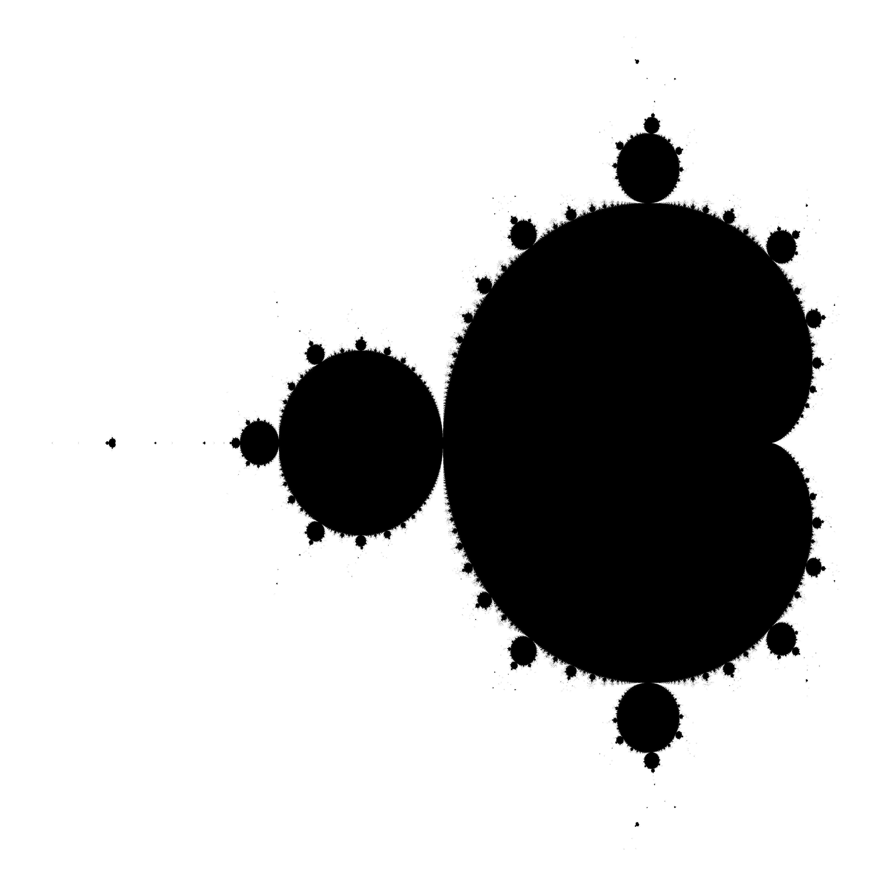
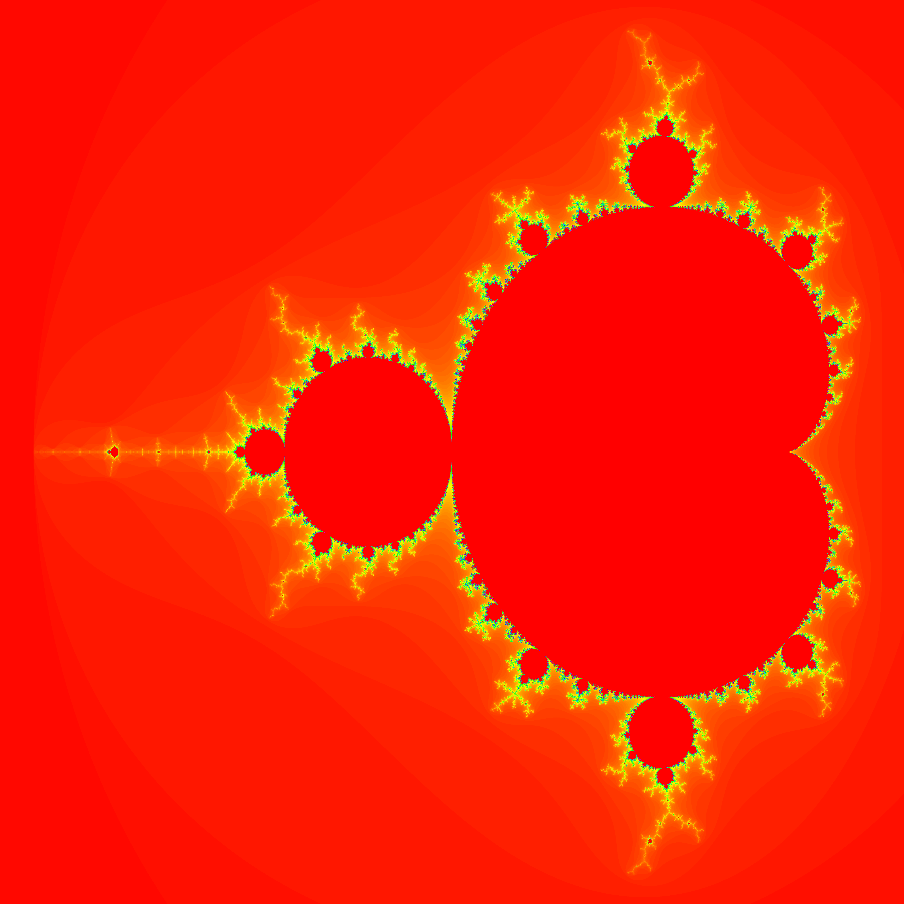

# Problem 1
## Zbiór Mandelbrota - Epizod I

---
### Opis problemu

Celem ćwiczenia jest napisanie programu w Java, który generuje (sekwencyjnie, nie wielowątkowo) piksel
po pikselu zbiór Mandelbrota (czyli zbiór takich *c*, dla których odwzorowanie $z_{n+1}=z_{n}^2 + c$ nie
rozbiega się do nieskończoności przy $z_0 = 0$). Program ma się składać z funkcji generującej i
zwracającej obrazek o zadanych rozmiarach (BufferedImage), oraz funkcji (niekoniecznie jednej) służącej
do wykonania funkcji generującej obrazek zadaną liczbę razy i uśrednienia czasu (System.nanoTime)
jej wykonania.

Program ma po pierwsze być w stanie wygenerować i zapisać do pliku obrazek dla zadanych parametrów
wejściowych. Po drugie, program ma również być w stanie zapisać plik zawierający średni
czas generacji obrazka w funkcji liczby pikseli obrazka. Czas ten należy wyznaczyć dla obrazków o
bokach 32, 64, 128, 256, 512, 1024, 2048, 4096 i 8192 piksele. Należy też narysować wykres (nie w Java i
nie w ROOT).

Obrazek ma być kolorowany przynajmniej w odcieniach szarości (zależnych od liczby iteracji). Możecie
też znaleźć w sieci jakąś ładną paletę kolorów, ale należy wtedy wskazać źródło. Przy parametrach
podanych poniżej wygenerowany obrazek będzie wyglądał pi * drzwi jakoś tak (zależy to oczywiście od
sposobu kolorowania):

Jak już upewnicie się, że dobrze działa, to pobawcie się tym, znajdźcie jakiś ładnie wyglądający obszar
fraktala i wygenerujcie trochę fajnych obrazków (ale uśrednianie czasu ma się odbywać dla domyślnego
zestawu parametrów).

---
### Parametry 

Funkcja generująca obrazek ma przyjmować następujące parametry:
    
- szerokość obrazka w pikselach 
- wysokość obrazka w pikselach
- rogi prostokąta w przestrzeni parametru *c* określające, jakiemu obszarowi odpowiada powierzchnia
generowanego obrazka (domyślnie przyjmujemy od [-2.1, -1.2] do [0.6, 1.2]).
- maksymalną liczbę iteracji (domyślnie zakładamy, że 200)

Funkcja uśredniająca czas wykonania ma przyjmować następujące parametry:

- rozmiary obrazków, dla których należy dokonać uśrednienia
- liczbę powtórzeń dla każdego rozmiaru

